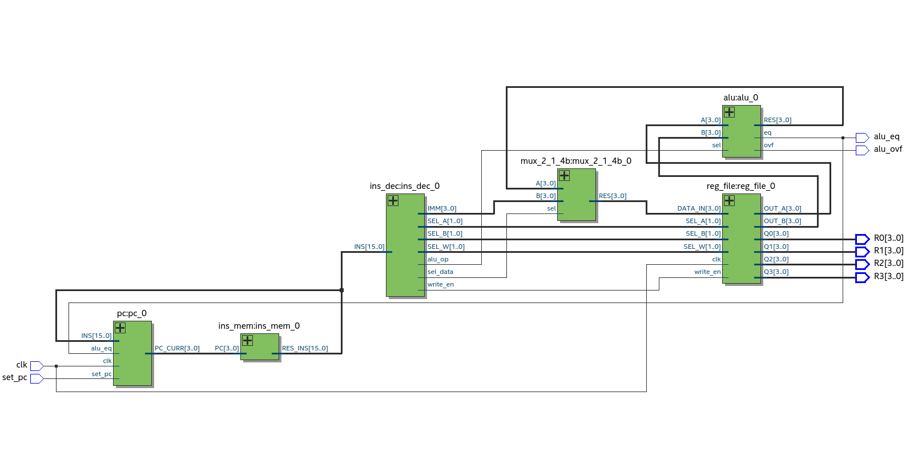
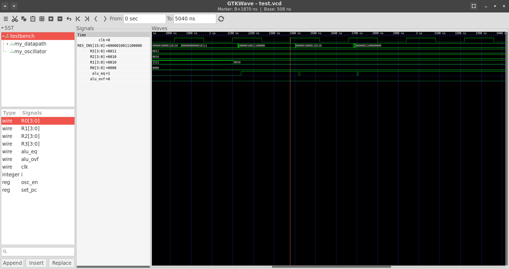

# CPU core from logic gates
A 4-bit CPU core using only wires and logic gates. Implemented using Verilog.

## Specifications
- Register width: 4 bits
- Instruction length: 16 bits
- Number of instructions: 16
- Instruction memory size: 256 bits
- Clock period: 280 ns
- Single cycle

## Gate delays
- AND: 3 ns
- OR: 3 ns
- NAND: 2 ns
- NOR: 2 ns
- NOT: 1 ns
- XOR: 4 ns
- XNOR: 5 ns

## Instructions
For all instructions' machine code

- Bits[15:8]: opcode

**add regd rega regb**

- Opcode: 00000000
- Effect: regd = rega + regb, PC += 1
- Example: add reg0 reg1 reg2
- Machine code
  - Bits[7:6]: unused
  - Bits[5:4]: d
  - Bits[3:2]: a
  - Bits[1:0]: b

**nand regd rega regb**

- Opcode: 00000001
- Effect: regd = rega ↑ regb, PC += 1
- Example: nand reg0 reg1 reg2
- Machine code
  - Bits[7:6]: unused
  - Bits[5:4]: d
  - Bits[3:2]: a
  - Bits[1:0]: b

**move regd IMM**

- Opcode: 00000010
- Effect: regd = IMM, PC += 1
  - IMM is a 4 bit signed immediate
- Example: move reg0 0000
- Machine code
  - Bits[7:6]: unused
  - Bits[5:4]: d
  - Bits[3:0]: IMM

**noop**

- Opcode: 00000011
- Effect: PC += 1
- Example: noop
- Machine code
  - Bits[7:0]: unused

**branch JMP rega regb**

- Opcode: 00000100
- Effect: PC = (rega == regb) ? PC + JMP : PC + 1
  - JMP is a 4 bit signed immediate
- Example: branch 0011 reg0 reg1
- Machine code
  - Bits[7:4]: JMP
  - Bits[3:2]: a
  - Bits[1:0]: b


## Schematic
High-level schematic of datapath, generated using [Intel Quartus Prime](https://www.intel.com/content/www/us/en/products/details/fpga/development-tools/quartus-prime.html).



## Getting started
This is an example of running an assembly file on the CPU.
This example uses [Icarus Verilog](http://iverilog.icarus.com/) and [GTKWave](http://gtkwave.sourceforge.net/) on Linux.

1. Locate assembly file, i.e. ins_mem/programs/general.tass
2. Build instruction memory module
```
$ pwd
<4-bit-cpu>
$ cd ins_mem/
$ ./assembler programs/general.tass
$ cd ../
```
3. Build datapath module
```
$ pwd
<4-bit-cpu>
$ cd datapath/
$ ./build.sh
```
3. Run simulation
```
$ pwd
<4-bit-cpu>/datapath
$ vvp testbench
```
4. View waveform
```
$ pwd
<4-bit-cpu>/datapath
$ gtkwave test.vcd
```



## Design files
Designs for circuits can be viewed in [designs.pdf](designs.pdf).
